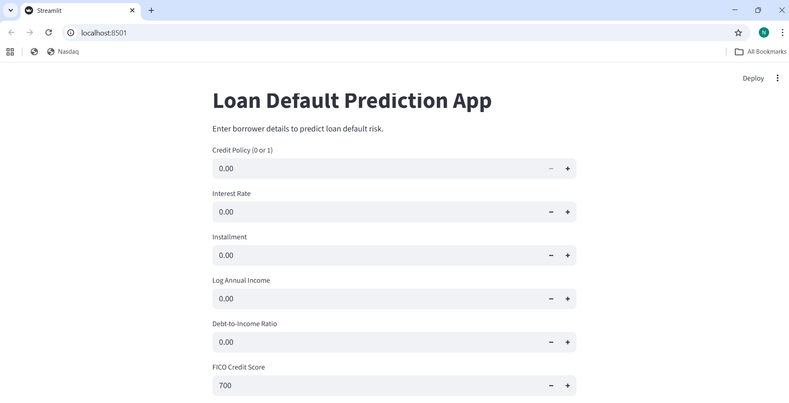
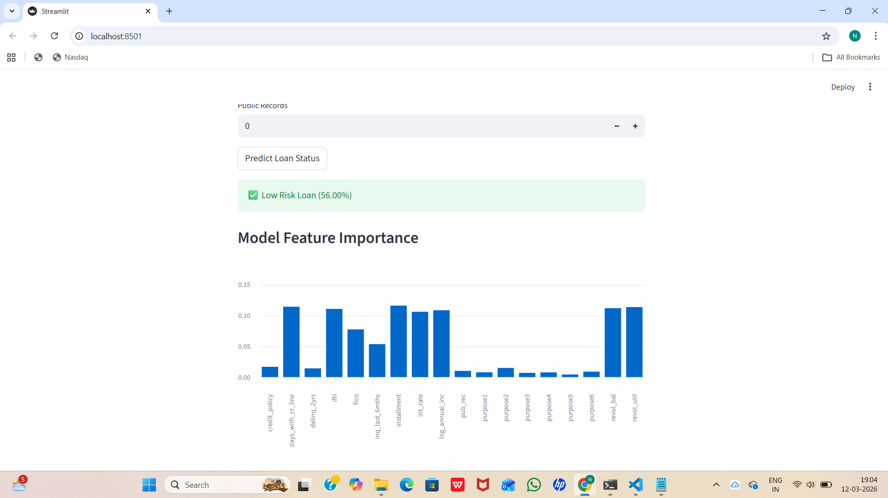

# Loan Default Risk Prediction using Machine Learning

## Overview
Loan default prediction is an important problem in the financial sector. Lending institutions must evaluate borrower risk before approving loans. This project applies machine learning techniques to predict whether a borrower is likely to default based on financial and credit-related information.

The system also includes an interactive web application built using Streamlit, allowing users to input borrower details and receive a real-time prediction of loan default risk.

## Problem Statement
Financial institutions face significant losses when borrowers fail to repay loans. By analyzing borrower financial features such as credit score, income, debt-to-income ratio, and credit history, machine learning models can help identify high-risk borrowers before loan approval.

## Dataset
The dataset used in this project contains borrower financial information including:

Credit Policy  
Interest Rate  
Installment Amount  
Annual Income  
Debt-to-Income Ratio  
FICO Credit Score  
Revolving Balance  
Revolving Utilization  
Inquiries in Last 6 Months  
Delinquencies in Last 2 Years  
Public Records  

These features help the model understand borrower financial behavior and risk patterns.

## Machine Learning Models
This project implements and compares multiple classification algorithms including:

Logistic Regression  
Random Forest  

Both models were trained and evaluated to compare their performance. Logistic Regression was selected as the final model for deployment in the Streamlit application due to its stable performance and interpretability.

## Project Workflow
Data collection and loading dataset  
Data cleaning and preprocessing  
Exploratory Data Analysis (EDA)  
Feature selection and engineering  
Train-test split of dataset  
Model training using Logistic Regression and Random Forest  
Model evaluation using accuracy, ROC curve, AUC score, and cross validation  
Saving the trained model using pickle  
Building a prediction interface using Streamlit  

## Model Performance
Model Accuracy: approximately 84%

Evaluation metrics used:

Accuracy Score  
ROC Curve  
AUC Score  
Cross Validation  

The model predicts whether a loan is:

Low Risk Loan  
High Risk of Default  

## Streamlit Web Application
The Streamlit application allows users to enter borrower financial information, predict loan default risk, view prediction probability, and visualize model feature importance.

## Application Screenshots

Loan Risk Prediction Output  

Feature Importance Visualization  

## Technologies Used
Python  
Pandas  
NumPy  
Scikit-learn  
Matplotlib  
Streamlit  

## Project Structure
loan-default-prediction

app.py  
loan_default_model_training.ipynb  
loan_data.csv  
loan_default_model.pkl  
loan_default_prediction.png  
model_feature_importance.png  
README.md  

## How to Run the Project

Install dependencies:

pip install streamlit pandas numpy scikit-learn matplotlib

Run the Streamlit application:

streamlit run app.py

## Future Improvements
Use advanced models such as XGBoost and Gradient Boosting  
Perform hyperparameter tuning  
Deploy the application online  
Add explainable AI techniques such as SHAP  

## Author
Manneti Yeswanth Reddy  
B.Tech Artificial Intelligence and Data Science  
Saveetha School of Engineering
